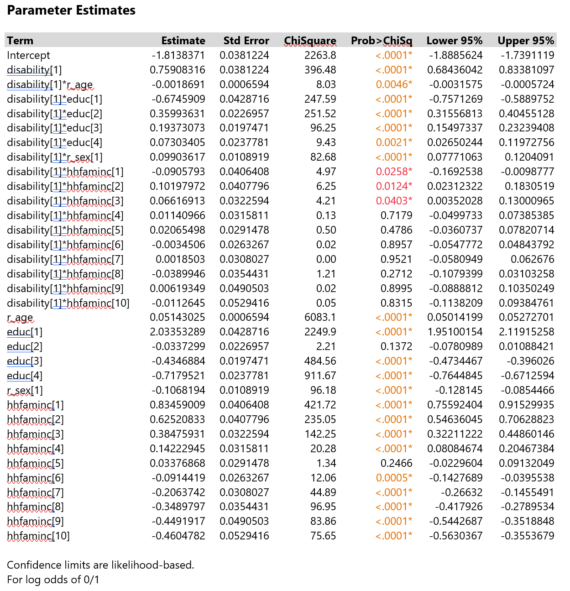

```{r setup, include=FALSE}
knitr::opts_chunk$set(echo = TRUE)
```


The confidence intervals and tests are Wald-based because the data 
has more than 1,000 rows.

We performed a GLM with a Logit Link looking at the effect of having 
a travel limiting disability combined with education, sex, age, and 
income have on subjects participation in the workforce.

Our results showed that all the effects were extremely significant. 

Our main goal is understanding the odds of being disabled have on 
being able to work. So to explore further we did a nominal logistic
regression. 


You can see that all the effects and interactions in the nominal 
logistic regression were significant with p values of almost all 
<0.00001


You can see that disability which is a binary response is significant, 
as well as all variable interactions with disability.


Normal approximations used for ratio confidence limits effects: 
disability educ r_sex 
Tests and confidence intervals on odds ratios are Wald based.

You can clearly see that if a subject has a travel limiting disability 
they are 5.6 times more likely to not be in the workforce than if they 
did not have the travel limiting disability. This comes with a prob>Chisq
of <0.0001 so quite a significant odds ratio. 

This dataset includes other variables that we weren’t initially 
interested in. A total of nine variables could be used to explain 
workforce participation. So we performed a principle components analysis 
to see if there was a more straightforward way of explaining the response. 

Here is the correlation matric of all the variables included in the PCA. 


These are the summary plots of the PCA. You can see that some variables
occupy similar quadrants. Age, wheelchair, and disability are grouped,
Education and income and grouped. However, some variables don’t seem to 
have similar groupings such as sex, race, and metropolitan size. The first
3 principle components had eigen values of 1 or higher. However the next 
3 components had eigenvalues of nearly three. 


You can see here that the first three components explain only 53% if the
total variation which is acceptable but not amazing. If you include the
first six components that jumps to 85% of the variation is explainable with
these components. So it technically has reduced the number of variables,
but it is not quite as simple as we had hoped. 


Scree plot showing the eigenvalues. The first six are all fairly similar
with the first two components especially having higher values. 


Formula for principle component analysis. It seems largely based on
wheelchair, disability, family income and education. 





We did a nominal linear regression with the six principle components. 
We found that all the components were significant. 

Looking at the first component, per unit change in PC1 subjects are 
0.5 times more likely to not be in the workforce. PC2 says per each 
unit change subjects are 2.07 times more likely to not be in the
workforce. 

This analysis was interesting but is not as clear cut as we would have
hoped. 


